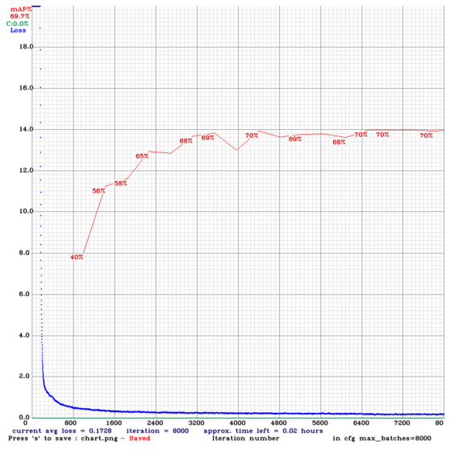
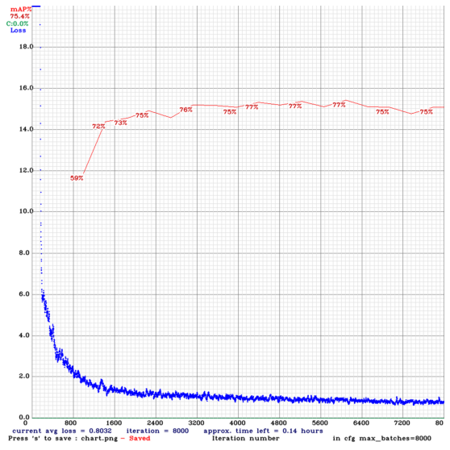
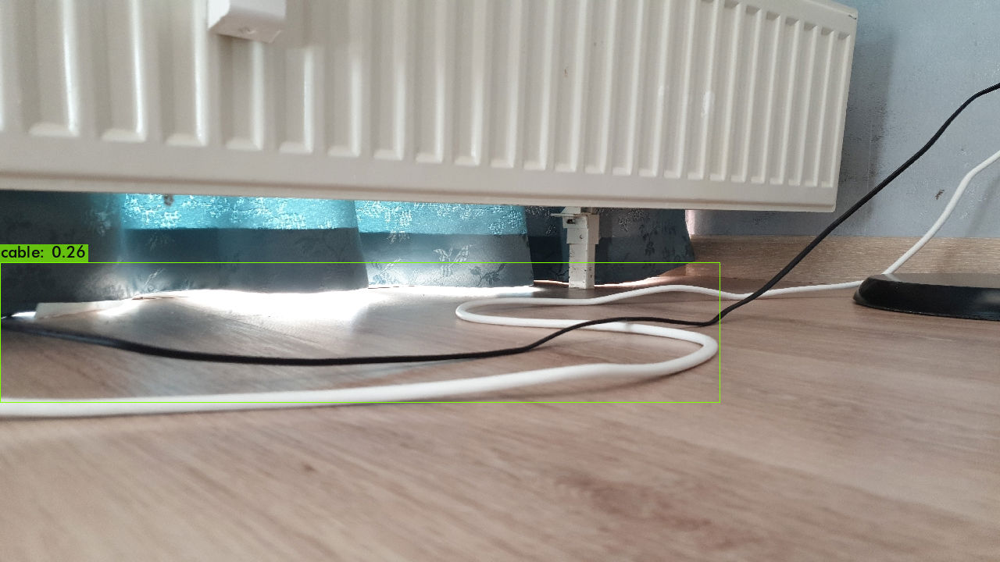
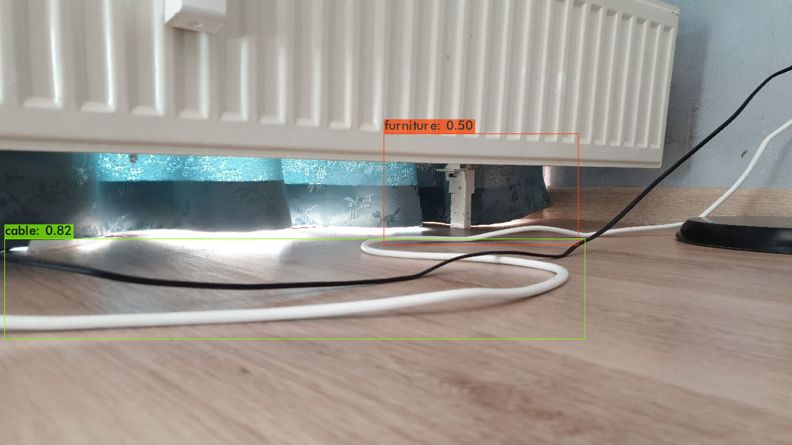

# RBEI

A Hackathon Project for Robert Bosch Engineering and Business Solutions

## Instructors to setup the lab environment

The below steps only provide an overview, please use the notebook for code artifacts for each of the steps. 

### Data Preparation

- Clone this folder into your workstation (GPU enabled), lets call this folder `workspace`. 
- Download the raw data zip from [here](https://drive.google.com/file/d/1HxCIZDXQ9U3j7LtxLs-n17E3kmDijMhX/view?usp=sharing) to the workspace folder. The raw data contains images, csv (training.csv) file containing a record per bounding box on the image. 
- Upload the zip file to your workspace and unzip. Ensure the variable `raw_data` points to the location of the raw data.

### Pre-processing

The raw data contains the ~7900 tagged images (the tags are available inside the training_data.csv file per image) and 130002 tags across all images. Pre-processing involves converting this data into a format which darknet's yolov4 algorithm understands. 

Open the Jupyter notebook, and run the below steps

- Declare the below varibles and ensure your command prompt is set to the workspace folder. 

```
training_data = '/train/'
validation_data = '/val/'
current = '.'
%cd [workspace_folder]
```
- Train Test split as per the required ratio
  
```
from sklearn.model_selection import train_test_split
df_train, df_val = train_test_split(df, test_size = 0.2, shuffle=True, random_state=42)
```
- Clone the darknet directory, this folder is needed because the training data is cretaed under darknet/data in the step below. 
- Split the data into train and validation folders. In each folder we have the training images and a .txt file per image which contains the details of the bounding box. 
- The notebook also creates a train.txt and test.txt files which contains the path to images that will be used for training and validation.
  
### How to Train

- Compile darknet
- Training with Tiny Config (approx 2-3 hours)
  - Copy the yolov4-tiny-custom.cfg to darknet/cfg
  - Download pre-training model 
    ```
    !wget https://github.com/AlexeyAB/darknet/releases/download/darknet_yolo_v4_pre/yolov4-tiny.conv.29
    ```
  - Run the training
    ```
    !darknet/darknet detector train obj.data darknet/cfg/yolov4-tiny-custom.cfg yolov4-tiny.conv.29 -map -dont_show```
- Training with full config (approx 8 hours)
  - Copy the yolov4-custom.cfg to darknet/cfg
  - Download pre-training model 
    ```
    !wget https://github.com/AlexeyAB/darknet/releases/download/darknet_yolo_v3_optimal/yolov4.conv.137
    ```
  - Run the training
    ```
    !darknet/darknet detector train obj.data darknet/cfg/yolov4-custom.cfg yolov4.conv.137 -map -dont_show```

### About the outcome of training

The below images show how the training has progressed for both Tiny and full configuration. 

- Run log with Tiny Configuration
  
The highest mAP was 70% 



- Run log with Full Configuration

The highest mAP was 77%



The data used for the training is created from scratch no public datasets are used, hence the model can further be improved with more variety of training data. 

### Inference

This section focuses on how do you run and test an image for identifying objects belonging to classes - furniture, small garments, wire and doors. 

1. Clone and Make the darknet code (refer to the notebook on steps to do this)
2. Download the obj.data and configuration from this repository (cfg/ contains the configuration)
3. Download the best model - [tiny model](https://drive.google.com/file/d/100I1cdX6SQfucPZIHE9MdS1S9lxUrywU/view?usp=sharing), [full model](https://drive.google.com/file/d/19AdjTg3l4Ihwy3BaxtX5rcXAsZRKDg-B/view?usp=sharing)
4. Run the below command

```
!./darknet detector test obj.data [path to .cfg file] [path to best model] [path to test image] -dont_show
```
Here is an example

```
# Testing with Tiny configuration and Best model using Tiny Configuration

!./darknet detector test obj.data cfg/yolov4-tiny-custom-test.cfg results/yolov4-tiny-custom_best.weights test/test-image-1.jpeg -dont_show

# Testing with Full configuration and Best moduel using Full configuration.

!./darknet detector test obj.data cfg/yolov4-custom-test.cfg results/yolov4-custom_best.weights test/test-image-3.jpeg.jpg -dont_show

```

5. The results of the test are stored in predictions.jpg

### Test Results

Here are some key results. 

| | Yolov4 Tiny| Yolov4 Full|
|--|--|-|
| mean Average Precision | 70 | 77 |
| Inference Time | 2.9 ms | 20 ms |
| Size of the Model | 22 mb | 244 mb |

The model is tested on Tesla P100 

#### Results from Tiny Config



#### Results from Full Config



### Miscelleneous

Code to remove augmentation files if -show_imgs is enabled while training. 

```
# # Code for cleaning up augmented files during training
# import os
# import tqdm
# for name in tqdm.tqdm(os.listdir('/content/drive/MyDrive/datasets/rbei/train_data_subsets/')):
#   if ('aug_' in name):
#     os.remove(os.path.join('/content/drive/MyDrive/datasets/rbei/train_data_subsets/', name))

```

